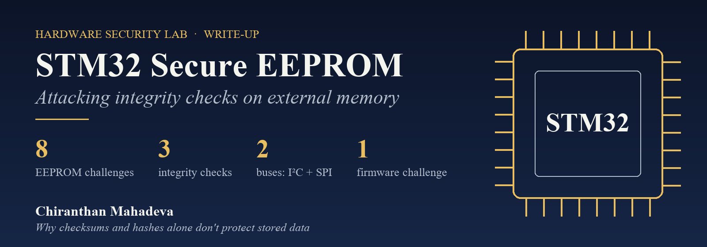
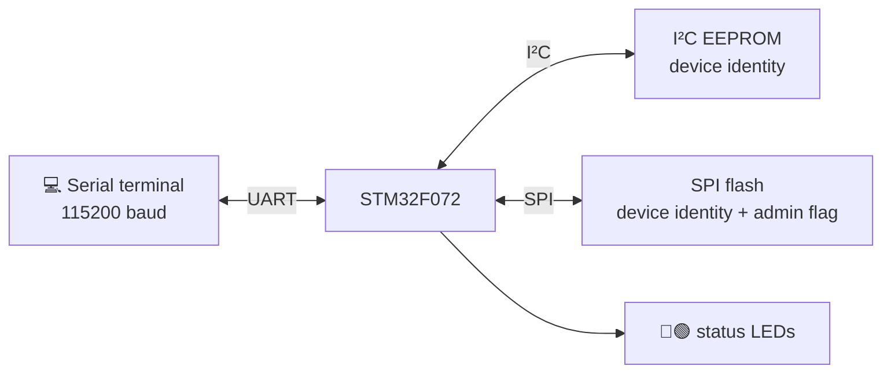

  

  
  
  

  <b>A hands-on lab on an STM32 "victim board" that stores device settings in external EEPROM 
  and tries to protect them with a checksum, an additive hash and MD5. This write-up shows why that isn't enough.</b>

## 🎯 The challenge

The board stores its **device identity** (product type, hardware tier, region lock, manufacturer, product name, serial number) in two external memories:
an **I²C EEPROM** and an **SPI flash**. The firmware reads these values at startup to decide which features are unlocked.

The goal: **change the identity to unlock everything** (development mode, top hardware tier, no region lock) **without the firmware noticing**.
Each level adds one more integrity check.

## 🧩 Levels

| Level | Protection | Weakness | How it was bypassed |
|---|---|---|---|
| **Basic** | None | Data is trusted as-is | Edit the identity bytes directly |
| **Medium** | 8-bit checksum | Anyone can recompute it | Edit, then recompute the sum and write it back |
| **Advanced** | + 32-bit additive hash | Same: no secret involved | Recompute the sum of the protected bytes and store it |
| **Hard** | + MD5 | MD5 without a key is just a fingerprint | Recompute MD5 over the new data and overwrite the stored hash |
| **Admin** | Password + enable flag | Password stored in plain text in EEPROM | Set the enable flag, read the password from memory |
| **Firmware** | Hard-coded secrets | Secrets inside the firmware | Static analysis: plain-text string and fixed-key XOR |

Each level exists on **both buses** (I²C and SPI), giving 8 EEPROM challenges plus the admin and firmware challenges.
Full walkthrough: **[docs/02_challenges.md](docs/02_challenges.md)**

## 💡 Key takeaway

> **Integrity checks without a secret key only detect accidents, not attackers.**
> Checksums, sums and plain hashes can be recomputed by anyone who can write the memory.

What would actually protect the data: a **keyed MAC (HMAC/CMAC) or a digital signature**, with the key kept in **protected internal flash or a secure element**,
plus **readout protection** on the MCU and **no secrets stored in plain text**. More in **[docs/03_lessons_learned.md](docs/03_lessons_learned.md)**.

## 📚 Read more

| Document | |
|---|---|
| [1. Hardware & memory map](docs/01_hardware.md) | Board, pins, and where each value lives in the EEPROM |
| [2. Challenges & approach](docs/02_challenges.md) | Every level: what it checks and how it was defeated |
| [3. Lessons learned](docs/03_lessons_learned.md) | Why it failed and how to design it properly |

## 🙏 Credits

The target firmware (**"Victim Board V2.2" by Henrik Ferdinand Noelscher**) was provided as a lab exercise and is **not redistributed here**.
To keep the exercise useful for others, this write-up describes the **methods only**: no flags, passwords or keys.

**Author of this write-up:** Chiranthan Mahadeva
